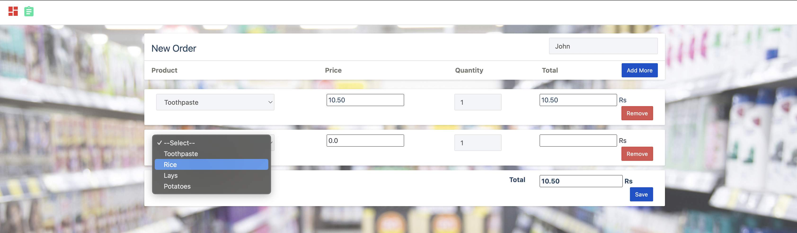
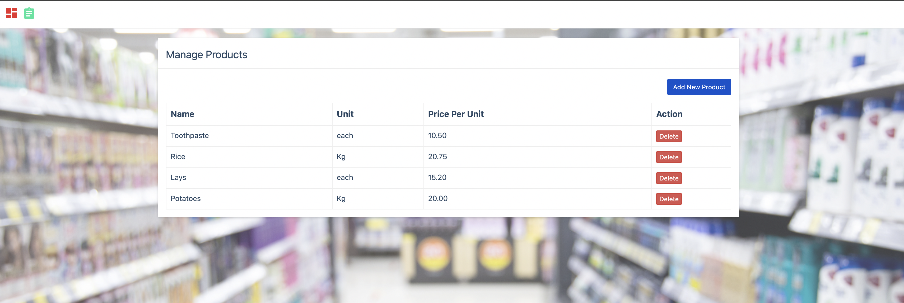
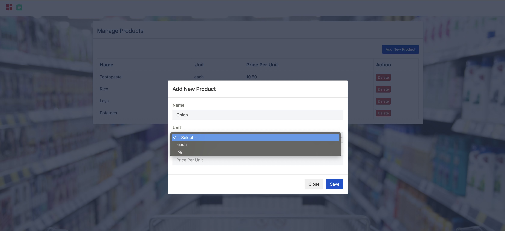
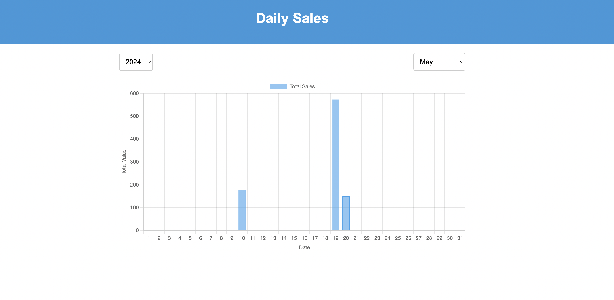
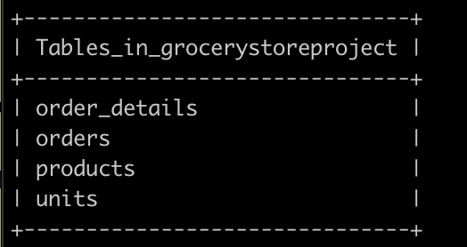
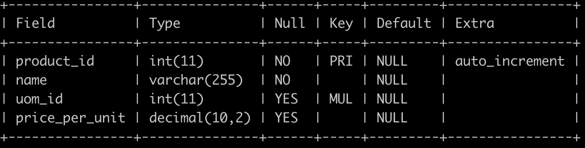
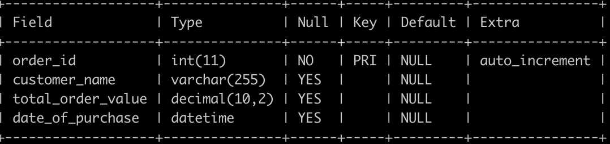
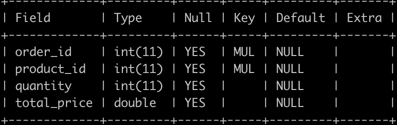
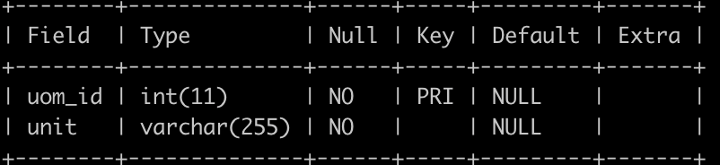

# GroceryStore

## Example

Here is a screenshot of the application:

Order Page

Create a new Order 

Products Page  

Add new Product 

Sales Data  

MySQL DB : Show Tables 

Table Descriptions :

Products Tables

Orders Tables

Order Details Tables

Units Tables

